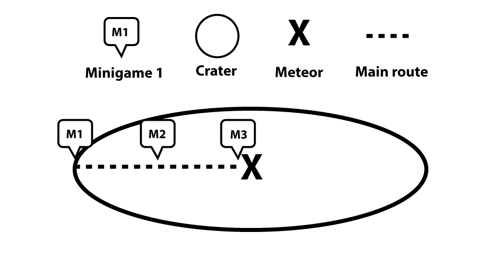
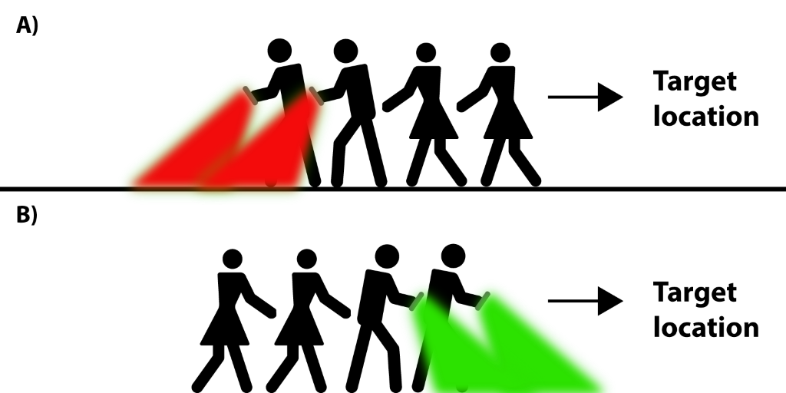

## What is MeteorQuest?
MeteorQuest is a prototype of a location-based mobile social game, where the players are guided to a real-world location to find and destroy a meteor. As the players are guided to the meteor, they are faced with three minigames that they must complete as illustrated in the following figure:



The game is developed as a four-player experience, and the purpose of open-sourcing it is to provide researchers and game developers with a platform that makes it easy to create a real-world game event. As it is right now, we have developed three minigames that can be part of the overall game experience, and we have made sure it’s easy for you to develop your own minigames and incorporate them in the game. In between the different mini-games, the players must work together to navigate. For that the players are divided into two roles: Communicators and navigators. The communicators are responsible for passing vital information in relation to the game to the other players. Several times during the game experience, the communicators will receive a call with information about the current stage of the game. This information ideally must be passed on to the other players. The navigators, on the other hand, are the only ones with access to the navigation methods called: Screen brightness and flashlight frequency. The screen brightness navigation method utilizes the brightness and color of the smartphone screen to tell the player, if they are getting closer or further away from the target, as seen in the next figure – green signals approaching the target, while red indicates moving away from the target. Flashlight frequency works similar to screen brightness, where the flashlight of the phone will turn on and off with different frequencies, depending on the players distance to the target - the closer they get, the faster it will blink.  



## Getting Started
MeteorQuest is a research platform developed for Android smartphones that allows researchers and developers to create game events in real-world locations. In order to create a game event, you just have to plot in the coordinates for the event (the meteor) in Google Firebase’s real-time database and install the application on your Android devices. The following sections will take you through the process of creating a game event and using MeteorQuest as a research platform.   

### Prerequisites
Before you can install and run the application you need to install and setup the following environments:

```
•	Android Studio (https://developer.android.com/studio/) 
•	Access to Google Firebase project (contact us for access)
```

### Setup
Setting everything up and creating a game event can be divided into five steps. These steps will shortly be presented here and further explained in the next sections. 

```
1.	Clone repository and open in Android Studio
a.	Install application on four devices
2.	Plot in coordinates in real-time database using the console in Google Firebase
3.	Start the game approximately 300 meters from the target
4.	When you start the application on the phones, the first screen will prompt you to type in the different player roles. Make sure to assign the roles 1-4 to the different players as illustrated in figure 3.
5.	Then you’re done with the setup and you can start the game. 

```

### Step 1

Explain how to run the automated tests for this system

### Break down into end to end tests

Explain what these tests test and why

```
Give an example
```

### And coding style tests

Explain what these tests test and why

```
Give an example
```

## Deployment

Add additional notes about how to deploy this on a live system

## Built With

* [Dropwizard](http://www.dropwizard.io/1.0.2/docs/) - The web framework used
* [Maven](https://maven.apache.org/) - Dependency Management
* [ROME](https://rometools.github.io/rome/) - Used to generate RSS Feeds

## Contributing

Please read [CONTRIBUTING.md](https://gist.github.com/PurpleBooth/b24679402957c63ec426) for details on our code of conduct, and the process for submitting pull requests to us.

## Versioning

We use [SemVer](http://semver.org/) for versioning. For the versions available, see the [tags on this repository](https://github.com/your/project/tags). 

## Authors

* **Billie Thompson** - *Initial work* - [PurpleBooth](https://github.com/PurpleBooth)

See also the list of [contributors](https://github.com/your/project/contributors) who participated in this project.

## License

This project is licensed under the MIT License - see the [LICENSE.md](LICENSE.md) file for details

## Acknowledgments

* Hat tip to anyone who's code was used
* Inspiration
* etc

